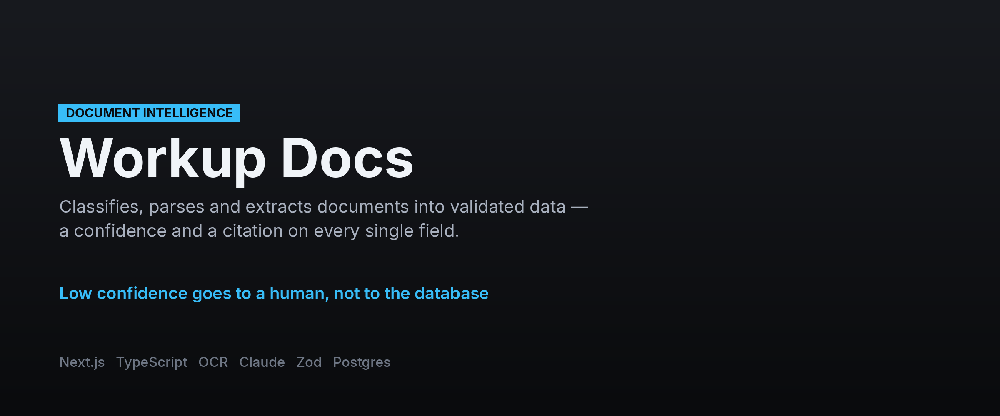
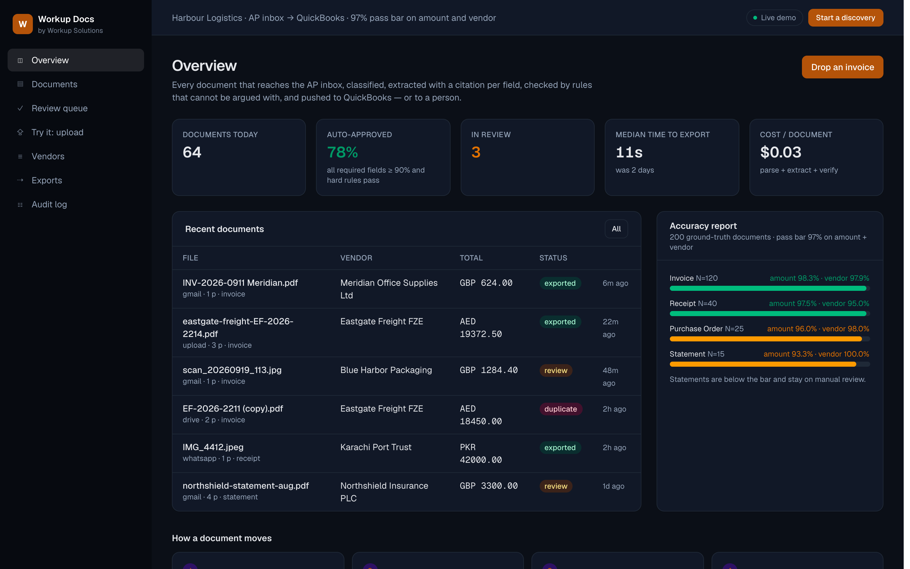

**[← All systems](https://github.com/musabqazi)** · [Voice Receptionist](https://github.com/musabqazi/voice-receptionist) · [Outbound Engine](https://github.com/musabqazi/outbound-engine) · [WhatsApp Agent](https://github.com/musabqazi/whatsapp-agent)

# Document Intelligence — document and invoice intelligence

Documents arrive (email, upload, folder, WhatsApp), get classified, parsed, extracted into
validated structured data with a confidence and a citation per field, checked against business
rules, and pushed to the system of record. Exceptions go to a human review queue; corrections
become tenant-specific examples.

file to `/api/extract` and get JSON back with confidences, citations and the rules verdict.

🟢 **Live demo:** https://workup-docs.vercel.app · **Source:** private, available on request

## Dashboard

The review queue: every extracted field carries a confidence and a citation; low-confidence fields route to a human.

## The problem

Manual data entry, errors, slow month-end. Finance, logistics, legal and receivables teams all
have a pile of documents that a person retypes.

## What it does

1. **Ingest and classify.** Gmail / Outlook, upload, Drive / S3 folder, WhatsApp. Haiku
   classifies on first-page text and layout hints.
2. **Parse and extract.** Docling (layout, tables, OCR); Gemini 2.5 Pro vision for handwriting
   and bad scans. Model A fills the Pydantic schema for the document type.
3. **Verify and validate.** Model B re-reads every field against the page and returns confidence
   plus a page/bbox citation. Then deterministic rules ([lib/rules.ts](lib/rules.ts), mirrored in
   [pipeline/rules.py](pipeline/rules.py)): line items sum, tax maths, total, ISO dates, currency,
   vendor master, PO match, duplicate detection (hash + fuzzy vendor/number/amount).
4. **Approve or review, then export.** All required fields ≥ 90 % and every hard rule passing →
   QuickBooks Online / Xero / Sheets / webhook / Postgres. Otherwise side-by-side review with the
   low-confidence fields highlighted; one-click correct. Duplicate suspects are never exported.

## How it holds in production

Never auto-approve below threshold or on a hard-rule failure. Every value carries a citation.
Eval set of 200 documents with ground truth; pass bar 97 % on amount and vendor fields; the report
is on the dashboard. Every document, extraction version and decision is in the audit log.

## Stack

    

## A note on what you can see here

The live demo runs on **seeded demo data** — a fictional tenant and synthetic records throughout. No client data appears in the demo or in this repository, and the implementation is private.

---
Part of the <a href="https://github.com/musabqazi">musabqazi portfolio</a> · source private. © 2026 Musab Qazi
